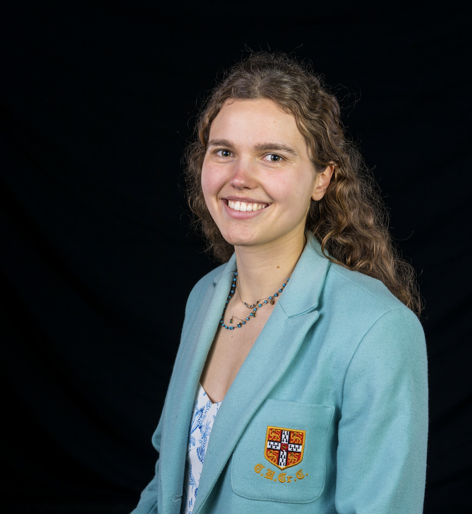

  

  

    <h2>Hi, I'm Lisanne Blok</h2>

    

      I am a PhD student researching extreme sea level and coastal flooding.
      I am passionate about applying scientific evidence to policy-making and
      helping communities become more resilient to environmental risks.
    

    

      My interests focus on the science-policy interface:
      How political is policy? How can scientists generate policy-relevant
      evidence? How can scientific findings be communicated most effectively?
    

  

<h2>Experience</h2>

<ul>
<li>PhD Intern, Defra UK Government (2026)</li>
<li>Bangladesh Heat Waves Research Placement, Imperial College London</li>
<li>Social Cost of Carbon Intern, Grantham Institute</li>
<li>Summer Placement, Institute of Economic Affairs</li>
</ul>

<h2>Education</h2>

<ul>
<li>PhD in Artificial Intelligence for Environmental Risk — University of Cambridge</li>
<li>MRes in Environmental Data Science — University of Cambridge</li>
<li>BSc in Geophysics — Imperial College London</li>
</ul>

<h2>Skills</h2>

<ul>
<li>Python</li>
<li>R</li>
<li>Excel</li>
<li>Scientific Communication</li>
<li>Policy Analysis</li>
<li>Public Speaking</li>
<li>Languages: Dutch & English (Fluent), German & French (B2)/li>
</ul>

<h2>Research Projects</h2>

<ul>
<li>Marine Litter: Abundance, Impact and Policy Implications (2026)</li>
<li>Classification and Drivers of Surge Regimes (2025)</li>
<li>Extreme Sea Level Variability (2025)</li>
<li>Earthquake Impact Assessment in Myanmar (2025)</li>
<li>Ocean Turbulence Estimation Using Deep Learning (2023)</li>
<li>Building Damage Estimation from Hurricanes (2023)</li>
</ul>

<h2>Publications</h2>

<a href="https://orcid.org/0009-0006-5944-4169">
ORCID Profile
</a>

<h2>Outside Research</h2>

I enjoy sailing, rowing, and spending time on the water.

